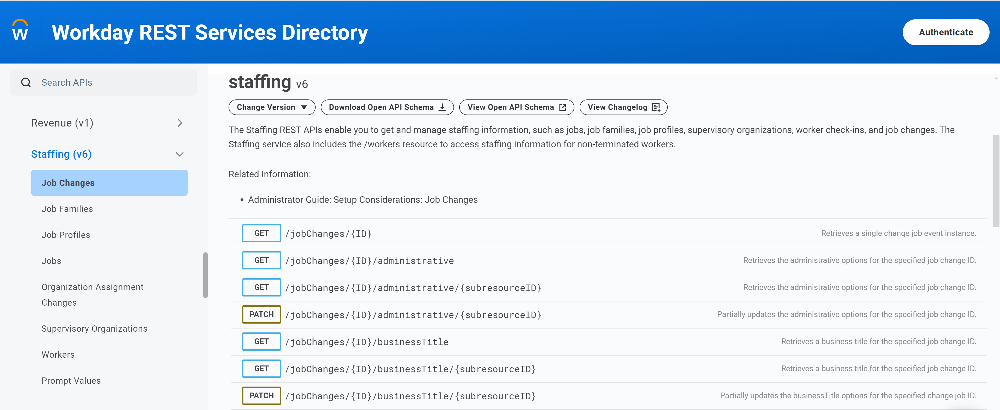

<!-- PROJECT LOGO -->
<div align="center" id="readme-top">
    
    <h3 align="center">Employee Management System Project</h3>
      <p align="center">
    <a href="#"><strong>View Demo</strong></a>
    ·
    <a href="#"><strong>Report Bug</strong></a>
    ·
    <a href="#"><strong>Request Feature</strong></a>
  </p>
</div>

<!-- TABLE OF CONTENTS -->
<details open>
  <summary>Table of Contents</summary>
  <ul style="list-style-type: square;">
    <li><a href="#introduction">Introduction</a>
    <li><a href="#assumptions">Assumptions</a>
    <li><a href="#project-outline">Project Outline</a>
    </li>
    <li><a href="#requirements">Requirements</a></li>
    <li><a href="#solution-and-design">Solution and Design</a></li>
    <li><a href="#team">Team</a></li>
    <li><a href="#contact">Contact</a></li>
    <li><a href="#appendix-and-glossary">Appendix and Glossary</a></li>
  </ul>
</details>

## Introduction

In today's dynamic workplace, effective employee management is essential. The goal is to design intuitive and powerful application architectures that seamlessly integrate both on-premises and cloud-based environments. By prioritizing simplicity and innovation, we aim to streamline HR processes, empower businesses to achieve their goals, and create solutions that are easy to use, adaptable to changing needs, and capable of delivering real business value.

## Assumptions

<ul style="list-style-type: square;">
<li><strong>The Employee Management System (EMS) is a greenfield project.</strong></li>
<li><strong>Organization use Active Directory as the user identity repository.</strong></li>
<li><strong>Organization use Microsoft 365 for its office suite technologies.</strong></li>
<li><strong>Organization has physical servers at their location when discussing the on-premises scenario.</strong></li>
<li><strong>While the design and architecture are flexible enough to work with any cloud provider, we may reference specific cloud services or software-as-a-service (SaaS) applications to illustrate how our system might function in a real-world scenario.</strong></li>
<li><strong>Main focus of this meeting is on system design and architecture and not project management or tooling.</strong></li>
<li><strong>The architecture incorporates non-functional requirements for security, performance, reliability, uptime, and accuracy.</strong></li>
</ul>

<p align="right">(<a href="#readme-top">back to top</a>)</p>

## Project Outline

### 1. Project Management
- **1.1 Project Planning**
  - Develop a detailed project plan, including timelines, milestones, and deliverables.
  - Define project management methodologies (e.g., Agile, Waterfall).

- **1.2 Resource Allocation**
  - Identify and allocate resources, including team members, tools, and budget.
  - Define roles and responsibilities.

- **1.3 Risk Management**
  - Identify potential risks and develop mitigation strategies.
  - Conduct regular risk assessments and update the risk management plan.

- **1.4 Communication Plan**
  - Establish a communication plan to ensure regular updates to stakeholders.
  - Schedule regular meetings (e.g., weekly status meetings, monthly reviews).

- **1.5 Quality Assurance**
  - Define quality standards and metrics.
  - Implement quality assurance processes, including regular reviews and audits.

- **1.6 Change Management**
  - Develop a change management plan to handle scope changes.
  - Implement a change control process to evaluate and approve changes.

- **1.7 Project Tracking and Reporting**
  - Use project management tools to track progress (e.g., Gantt charts, Kanban boards).
  - Generate regular status reports for stakeholders.

### 2. Project Initiation
- **2.1 Define Project Scope**
  - Understand and document the requirements.
  - Identify stakeholders and their roles.
  - Define project objectives and deliverables.

- **2.2 Feasibility Study**
  - Evaluate on-premise vs. cloud solutions.
  - Conduct cost-benefit analysis.
  - Assess technical feasibility and risks.

### 3. Requirements Gathering
- **3.1 Stakeholder Interviews**
  - Conduct interviews with HR managers, IT staff, and other key stakeholders.
  - Gather detailed requirements for each module.

- **3.2 Requirement Documentation**
  - Document functional and non-functional requirements.
  - Get approval from stakeholders on the documented requirements.

### 4. System Design
- **4.1 High-Level Architecture Design**
  - Design system architecture for both on-premise and cloud solutions.
  - Define data flow and integration points.

- **4.2 Detailed Design**
  - Create detailed design documents for each module (Employee Management, Position Management, Hiring Workflow, Data Integration, Reporting and Analytics).
  - Design database schema.
  - Define security protocols and authentication mechanisms.

### 5. Technology Selection
- **5.1 Evaluate Technologies**
  - Evaluate and select appropriate technologies for front-end, back-end, and database.
  - Choose tools for data integration and reporting.

- **5.2 Proof of Concept (PoC)**
  - Develop a PoC for critical components to validate technology choices.

### 6. Development
- **6.1 Set Up Development Environment**
  - Set up development and testing environments.
  - Configure version control and continuous integration/continuous deployment (CI/CD) pipelines.

- **6.2 Module Development**
  - Develop each module as per the design documents.
  - Conduct unit testing and code reviews.

### 7. Integration and Testing
- **7.1 System Integration**
  - Integrate all modules.
  - Ensure data exchange with internal enterprise systems and statewide employee management system.

- **7.2 Testing**
  - Conduct system testing, including functional, performance, and security testing.
  - Perform user acceptance testing (UAT) with HR managers and other stakeholders.

### 8. Deployment
- **8.1 Deployment Planning**
  - Plan deployment strategy for both on-premise and cloud solutions.
  - Prepare rollback plans and disaster recovery mechanisms.

- **8.2 Production Deployment**
  - Deploy the system to the production environment.
  - Monitor the system for any issues post-deployment.

### 9. Training and Documentation
- **9.1 User Training**
  - Conduct training sessions for HR managers and other users.
  - Provide user manuals and training materials.

- **9.2 Technical Documentation**
  - Document system architecture, design, and code.
  - Provide maintenance and troubleshooting guides.

### 10. Post-Deployment Support
- **10.1 Monitoring and Maintenance**
  - Monitor system performance and security.
  - Provide ongoing maintenance and support.

- **10.2 Feedback and Improvement**
  - Collect feedback from users.
  - Implement improvements and updates based on feedback.

### 11. Project Closure
- **11.1 Final Review**
  - Conduct a final review with stakeholders.
  - Ensure all project objectives and deliverables are met.

- **11.2 Project Documentation**
  - Compile all project documentation.
  - Archive project documents for future reference.

- **11.3 Lessons Learned**
  - Document lessons learned and best practices.
  - Conduct a project closure meeting with the team.

<p align="right">(<a href="#readme-top">back to top</a>)</p>

<!-- Requirements -->

<a id="requirements"></a>

## Requirements

### Employee Management
- **Record Management**
  - Manage personal details and job history of employees.
  - Track assignment history of employees to different positions.

### Position Management
- **Position Operations**
  - Create, reclassify, and abolish positions.
  - Assign employees to positions.
  - Track assignment history of positions to different employees.

### Hiring Workflow
- **Hiring Processes**
  - Facilitate workflows for hiring managers to request new or fill existing positions.
  - Implement an approval process managed by HR liaisons.

### Data Integration
- **Data Exchange**
  - Enable data exchange with internal enterprise systems.
  - Interface with statewide employee management systems for data exchange and reconciliation.

### Reporting and Analytics
- **Dashboards and Metrics**
  - Provide HR managers with dashboards to view key metrics.

### Performance and Scalability
- **Operational Efficiency**
  - Ensure smooth operation during peak usage times.
  - Maintain minimal downtime and implement quick recovery mechanisms.

### Security
- **Data Protection**
  - Safeguard sensitive employee data.
  - Secure employee authentication and manage profiles effectively.

<p align="right">(<a href="#readme-top">back to top</a>)</p>

<!-- Solution and Design -->
<a id="solution-and-design"></a>

## Solution and Design

### <div style="vertical-align:middle"></div>

<p>I propose adopting Workday as the HR solution for the frontend/client of the Employee Management system. Workday is a leading cloud-based human capital management (HCM) platform that offers a comprehensive suite of applications for managing various HR functions. Its cloud-native architecture, coupled with its extensive integration capabilities, makes it an ideal choice for our organization.</p>

#### Key Benefits of Workday:

<ul style="list-style-type: square;">
  <li><strong>Scalability and Flexibility</strong> : Workday's cloud-based nature ensures that it can easily scale to accommodate our organization's growth and changing needs without requiring significant infrastructure investments.</li>
  <li><strong>Streamlined Processes</strong>: Workday offers a unified platform for managing core HR functions, such as talent acquisition, performance management, compensation, benefits administration, and time and attendance tracking. This streamlines our HR processes and reduces administrative burdens.</li>
  <li><strong>Real-time Insights</strong>: Workday provides robust analytics and reporting capabilities, enabling us to gain real-time insights into our workforce data and make data-driven decisions.
  <ul><li><strong>Workday Data-as-a-Service (DaaS)</strong> is a cloud-based service that provides valuable data insights to Workday customers. It offers various services, such as benchmarking and analytics, to help organizations make informed decisions and optimize their business performance.</li>
  </ul>
  </li>
  <li><strong>Integration Capabilities</strong>: Workday seamlessly <code>integrates with on-premises and cloud-based systems</code>, ensuring a smooth transition and compatibility with our existing technology infrastructure.
    <ul>
  <li><strong>Workday RaaS (Reporting as a Service)</strong> is a powerful tool within the Workday platform that allows users to extract and analyze data from their Workday instances in real-time. It provides a flexible and efficient way to access and leverage your HR data for various purposes.</li>
    <li><strong>Data Integration</strong>: Use Workday Integration Cloud to connect Workday to your backend system and synchronize data between the two platforms.</li>
      <li><strong>Pre-built Connectors:</strong> Leverage pre-built connectors for common backend systems to simplify integration.</li>
  </ul>
  </li>
  <li><strong>Continuous Innovation</strong>: As a cloud-based solution, Workday is constantly updated with new features and functionalities, ensuring that we have access to the latest HR best practices and technologies.</li>
</ul>

Meets Non-Functional Requirements of `simplicity`, `innovation`, `practical`.

#### Workday API's:

`Employee Management`:

```
o	Record management including personal details, job history.
o	Track employee assignment history to different positions.  
```


`Position Management`:

```
o	Create, reclassify, and abolish position.
o	Assign employees to position.
o	Track position assignment history to different employees.   
```




`Hiring Management`:

```
o	Workflow for hiring managers to request new position or to fill an existing position.
o	Approval process by HR liaison   
```


`hiring workflow`: https://lucid.app/lucidchart/41cee53d-9f67-45b2-a025-6387505f89c4/view

<p align="right">(<a href="#readme-top">back to top</a>)</p>

### On-Premises Architecture


`On-premises Lucidchart`: https://lucid.app/lucidchart/f31361f2-b396-4df9-9e75-93edb16339be/view

<p align="right">(<a href="#readme-top">back to top</a>)</p>

<!-- Team Members -->

<a id="team"></a>

## Team Members
<a href="javascript:void(0);">
  <br/>
  <p>Ernie Lopez</p>
</a>

<p align="right">(<a href="#readme-top">back to top</a>)</p>

<!-- CONTACT -->

<a id="contact"></a>

## Contact
IT Department - California Department of Transportation <br/>
Email: it@dot.ca.gov <br/>
Project Link: [https://domain/caltrans/project_name](https://domain/caltrans/project_name)

<p align="right">(<a href="#readme-top">back to top</a>)</p>

<!-- Appendix and Glossary -->

<a id="appendix-and-glossary"></a>

## Appendix and Glossary

### Resources

| Workday API             | URL                                                                |
| ----------------- | ------------------------------------------------------------------ |
| Workday REST Services Directory | https://community.workday.com/sites/default/files/file-hosting/restapi/index.html |
| Workday Web Services (WWS) Directory (v43.0) | https://community.workday.com/sites/default/files/file-hosting/productionapi/versions/v43.0/index.html |

| Azure-Workday             | URL                                                                |
| ----------------- | ------------------------------------------------------------------ |
| Configure Workday to Microsoft Entra user provisioning | https://learn.microsoft.com/en-us/entra/identity/saas-apps/workday-inbound-cloud-only-tutorial |
| Configure Workday for automatic user provisioning | https://learn.microsoft.com/en-us/entra/identity/saas-apps/workday-inbound-tutorial |


### Explanation of Components and Interactions

#### On-Premises Solution

1. **Web Server (Load Balancer)**: Distributes incoming traffic across multiple application servers to ensure high availability and reliability.
2. **Application Servers**: Hosts the core business logic and processes requests from the web server.
3. **Database Server**: Stores all employee and position data. Can be a relational database (e.g., MySQL, PostgreSQL) or a NoSQL database (e.g., MongoDB) depending on the data requirements.
4. **Reporting & Analytics Server**: Generates reports and dashboards for HR managers. This could be a separate server or integrated into the application servers.
5. **Internal Enterprise Systems**: Interfaces with existing internal systems for data exchange and reconciliation.

#### Cloud-Based Solution

1. **Load Balancer (AWS ELB, GCP LB)**: Similar to the on-premises load balancer but managed by the cloud provider, ensuring scalability and high availability.
2. **Application Servers (EC2, GCE, Azure VM)**: Virtual machines hosted in the cloud to run the application logic.
3. **Managed Database Service (RDS, Cloud SQL, etc.)**: Cloud-based database services that offer automated backups, scaling, and maintenance.
4. **Managed Analytics (AWS QuickSight, GCP BigQuery)**: Cloud-based analytics services that provide scalable and efficient data processing and visualization.
5. **Internal Enterprise Systems**: Interfaces with existing internal systems for data exchange and reconciliation.

### Justification of Technologies and Design Patterns

#### On-Premises Solution

1. **Load Balancer**: Ensures high availability and fault tolerance.
2. **Application Servers**: Separation of concerns and scalability.
3. **Database Server**: Centralized data storage with ACID compliance for relational databases or flexibility for NoSQL databases.
4. **Reporting & Analytics Server**: Dedicated resources for data processing and visualization.
5. **Internal Enterprise Systems**: Seamless integration with existing infrastructure.

#### Cloud-Based Solution

1. **Load Balancer (AWS ELB, GCP LB)**: Managed service that scales automatically and provides high availability.
2. **Application Servers (EC2, GCE, Azure VM)**: Flexible and scalable compute resources.
3. **Managed Database Service (RDS, Cloud SQL, etc.)**: Automated management, backups, and scaling reduce operational overhead.
4. **Managed Analytics (AWS QuickSight, GCP BigQuery)**: Scalable and efficient data processing and visualization without the need for managing infrastructure.
5. **Internal Enterprise Systems**: Cloud services can easily integrate with on-premises systems through secure VPNs or dedicated connections.

### Design Patterns

1. **Microservices Architecture**: For both solutions, breaking down the application into smaller, independent services can improve scalability and maintainability.
2. **Event-Driven Architecture**: Useful for the hiring workflow and approval processes, where different components can react to events asynchronously.
3. **Data Integration Patterns**: Use APIs and ETL (Extract, Transform, Load) processes for data exchange and reconciliation with internal and statewide systems.
4. **Security Patterns**: Implement OAuth or SAML for secure authentication and role-based access control (RBAC) for authorization.

By leveraging these components and design patterns, both on-premises and cloud-based solutions can meet the requirements effectively while ensuring scalability, performance, and security.

<p align="right">(<a href="#readme-top">back to top</a>)</p>
